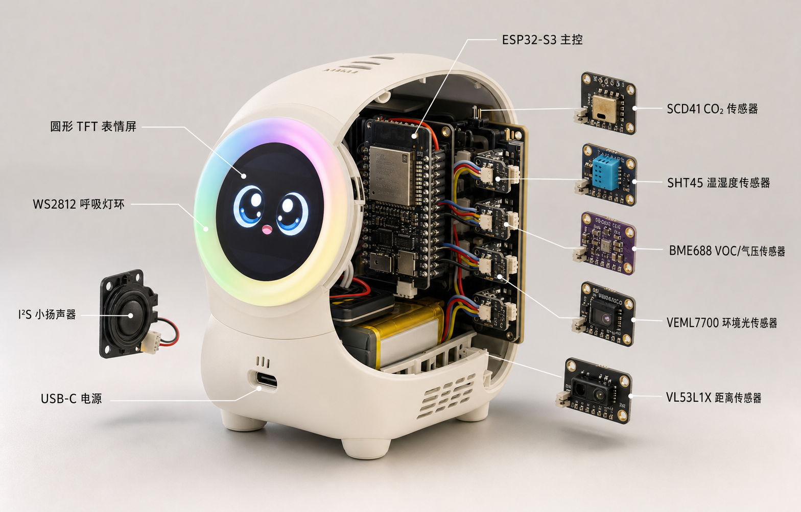
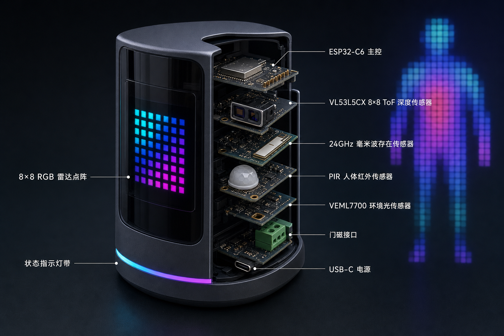
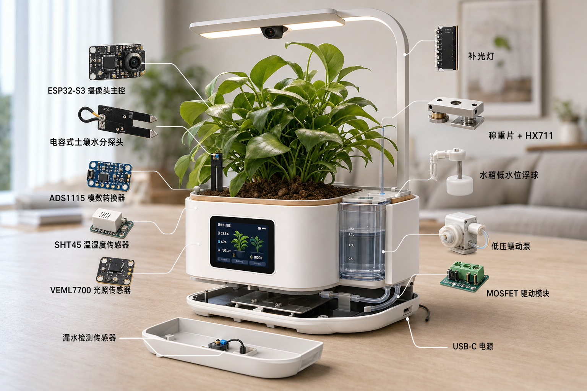

# 三个有惊艳感的 ESP32 多传感器物联网项目

## 高密度摘要

- **一句话结论**：依次制作“空气精灵、空间雷达、植物生命舱”，可以从多传感器采集与可视化，逐步学到传感器融合、实时通信、闭环控制、低功耗与设备可靠性。
- **核心机制**：每个项目都围绕一个可被观众立即感知的反馈闭环设计——环境变化引发表情和光效、人体动作生成空间图像、植物状态驱动灌溉和成长叙事。
- **判断入口**：第一次做选空气精灵；喜欢科幻交互选空间雷达；希望完成一个可长期运行的综合作品选植物生命舱。
- **常见误区**：惊艳感主要来自连贯反馈、外壳和数据叙事，而不是传感器数量；先逐个验证模块，再做融合，不要一次把所有模块接上。
- **相关文档**：[常见传感器硬件项目方案与选型指南](../h/hardware-sensor-project-recommendations.md)、[M5Stack 深度指南](../m/m5stack.md)、[技术索引](../technology.md)。

> 方案核对日期：2026-07-10。建议用 Arduino C++ 写 ESP32 固件，用 MQTT/WebSocket 连接运行在电脑、NAS 或树莓派上的 Node.js 服务。这样既能学习嵌入式，也能继续使用 npm、数据库与 Web 可视化生态。

## 项目路线总览

| 项目 | 惊艳瞬间 | 推荐主控 | 主要接口 | 核心能力 | 建议周期 |
|------|----------|----------|----------|----------|----------|
| 会呼吸的空气精灵 | 对着它呼气，表情、颜色和“呼吸速度”立即变化 | ESP32-S3；简化版可用 C6 | I²C、SPI、WS2812 | 采样、显示、MQTT、数据解释 | 1–2 个周末 |
| 无摄像头空间雷达 | 不使用摄像头也能显示位置、距离、方向和隔空手势 | ESP32-C6 或 S3 | UART、I²C、GPIO | 传感器融合、状态机、WebSocket | 2–4 个周末 |
| 赛博植物生命舱 | 植物会“表达口渴”、自己喝水，并生成成长短片 | 带 PSRAM 的 ESP32-S3 | ADC/I²C、UART、GPIO、Camera | 校准、闭环控制、故障保护、OTA | 4–6 个周末 |

推荐按表格顺序做。三者会复用 MQTT、设备配置、日志、OTA 和 Web 仪表盘代码，第三个项目不会从零开始。

## 项目一：会呼吸的空气精灵



### 作品体验

做一个拳头大小的桌面生物：圆形屏幕显示眼睛，RGB 灯环像肺一样缓慢明暗。空气清新时它平静呼吸；CO₂ 上升时开始犯困；VOC 或颗粒物突然增加时皱眉并变色；手靠近时它会转头、眨眼并显示当前数据。

最有效的演示是对着设备附近呼气：真实 CO₂ 数值上升，角色从精神变困倦，灯环呼吸频率改变。SCD41 是真实光声 NDIR CO₂ 传感器，规定测量范围 400–5000 ppm，响应不是瞬时的，因此动画应表现趋势而不是伪造立即跳变。[Sensirion SCD41](https://sensirion.com/products/catalog/SCD41)

### 硬件组合

| 部件 | 作用 | 必选程度 |
|------|------|----------|
| ESP32-S3 + PSRAM 开发板 | 驱动彩屏、动画、联网 | 必选；只用 OLED/灯环时可换 C6 |
| SCD41 | 真 CO₂、温湿度辅助数据 | 必选 |
| SHT40/SHT45 | 更可靠的环境温湿度 | 推荐 |
| BME688 | VOC/IAQ 趋势、气压 | 推荐，不把 eCO₂ 当真 CO₂ |
| VEML7700 | 环境光，自动调节屏幕和灯环亮度 | 推荐 |
| VL53L1X | 检测手靠近和挥动 | 推荐 |
| 圆形 TFT/OLED + WS2812 灯环 | 表情和呼吸反馈 | 至少选一种，最好两者都有 |
| 蜂鸣器或小型 I²S 扬声器 | 提示音和角色声音 | 可选 |

SHT45 的官方典型精度为 ±1%RH、±0.1°C，I²C 接口，适合把环境温湿度与设备内部发热区分开。[Sensirion SHT45](https://sensirion.com/products/catalog/SHT45)

### 能学到什么

1. I²C 总线、地址扫描和多个设备共线。
2. 不同采样周期：光照可以快，CO₂ 和温湿度应慢。
3. 把数值映射为状态，而不是只显示数字：例如 `fresh → stuffy → ventilate`。
4. TFT/LVGL 或 OLED UI、非阻塞动画和 WS2812。
5. Wi-Fi 配网、MQTT、Node.js 数据存储和网页趋势图。
6. 传感器预热、自热、异常值、断线恢复与 OTA。

### 分阶段实现

- **V1**：串口输出全部传感器，解决接线、地址和单位。
- **V2**：屏幕显示数据，灯环用颜色表示空气状态。
- **V3**：加入角色表情、呼吸动画和手势互动。
- **V4**：MQTT 上报，Node.js 页面显示 24 小时趋势，并增加“现在应不应该开窗”的判断。

### 最容易踩的坑

- 屏幕、稳压器和主控会发热，温湿度传感器必须与热源隔开并接触外界空气。
- BME688 的 eCO₂ 是算法估算，不应替代 SCD41。
- 角色反馈要做迟滞，例如 CO₂ 超过门限一段时间才改变状态，避免表情来回跳。

## 项目二：无摄像头空间雷达



### 作品体验

做一个不拍摄图像的桌面雷达：8×8 RGB 点阵或网页显示前方深度图，人靠近时出现彩色轮廓；手从左向右挥动可以换灯光场景；人在桌前静坐时设备仍能识别“有人”，离开后自动关闭屏幕和灯。

VL53L5CX 能输出 4×4 或 8×8 多区距离，最远约 4 m、最高 60 Hz，并提供分区运动信息；这使低分辨率空间图和手势成为可能。[ST VL53L5CX](https://www.st.com/en/imaging-and-photonics-solutions/vl53l5cx.html)

### 硬件组合

| 部件 | 作用 |
|------|------|
| ESP32-C6 或 ESP32-S3 | 采集、融合与联网；C6 还能继续实验 Thread/Zigbee |
| VL53L5CX | 8×8 深度图、方向和近距离手势 |
| 24 GHz 毫米波存在模块 | 检测静坐、呼吸等微动 |
| PIR | 低成本快速检测明显移动，作为第三种证据 |
| VEML7700 | 判断环境明暗，决定是否开灯 |
| 门磁 | 提供进入/离开事件，改善房间占用状态机 |
| 8×8 RGB 点阵或 LED 灯带 | 本地雷达图和跟随光效 |

ESP32-C6 集成 Wi-Fi、BLE 和 802.15.4 Thread/Zigbee，适合继续把项目扩展成智能家居端点。[Espressif ESP32-C6](https://docs.espressif.com/projects/esp-hardware-design-guidelines/en/latest/esp32c6/product-overview.html)

### 核心算法

不要简单地“任一传感器触发就算有人”，而要建立状态机：

```text
无人
  └─ PIR/ToF 快速变化 → 可能进入
       └─ 毫米波持续存在 → 已占用
            ├─ ToF 方向变化 → 手势事件
            └─ 多传感器持续安静 → 可能离开 → 延迟确认 → 无人
```

ToF 负责“在哪里、往哪边动”，毫米波负责“静坐时是否还在”，PIR 负责“低成本快速唤醒”，环境光负责“是否需要灯光”。这种互补关系就是传感器融合的核心。

### 能学到什么

1. UART 毫米波协议解析、I²C 高速数据、GPIO 中断。
2. 环形缓冲区、滑动窗口、去抖和超时。
3. 多传感器置信度、状态机和误报分析。
4. WebSocket 实时发送 8×8 距离矩阵。
5. 浏览器 Canvas 绘制热力图和调参面板。
6. 本地优先与隐私设计：上传状态和距离矩阵，不上传图像。

### 惊艳增强

- 让灯带的亮点跟随人的方向移动。
- 用双手距离控制灯光亮度，横向挥手切换场景。
- 浏览器同时显示 ToF 热力图、毫米波能量和融合后的占用置信度。
- 记录一天中“空间被怎样使用”，但不保存身份信息。

### 最容易踩的坑

- 毫米波可能穿透部分薄材料，风扇、窗帘和墙后活动会引起误报。
- ToF 会受强阳光、目标反射率和外壳盖板影响，必须在实际安装位置调试。
- ESP32-C6 的 Wi-Fi、BLE、802.15.4 共用一个 2.4 GHz RF 通路；不要把它当成高负载多协议并发网关。乐鑫也建议复杂 Wi-Fi + Thread/Zigbee 网关采用双 SoC。[ESP32-C6 RF 共存说明](https://docs.espressif.com/projects/esp-idf/en/stable/esp32c6/api-guides/coexist.html)

## 项目三：赛博植物生命舱



### 作品体验

把一盆植物变成有状态、有记忆的“生命体”：屏幕上的角色会根据光照、土壤、空气和水箱状态改变表情；它不是定时浇水，而是判断真的缺水后才喝水；称重传感器记录灌溉前后重量，计算植物吸收和蒸发趋势；摄像头每天拍一张，自动生成成长延时影片。

最惊艳的展示不是“泵会启动”，而是一条完整叙事：设备先显示口渴，检查水箱后少量浇水，重量曲线上升，随后表情恢复；一周后生成 20 秒成长影片并叠加光照、温湿度和饮水量。

### 硬件组合

| 部件 | 作用 | 工程注意 |
|------|------|----------|
| 带 PSRAM 的 ESP32-S3 摄像头板 | 图像、UI、联网 | 选择资料完整且能同时引出 I/O 的板型 |
| 电容式土壤水分探头 + ADS1115 | 土壤相对含水趋势 | 探头要封边防水；必须按土壤标定 |
| SHT40/SHT45 | 舱内温湿度 | 加通风孔，远离灯和主控 |
| VEML7700 | 植物实际获得的光照趋势 | 安装方向与叶片受光尽量一致 |
| 称重片 + HX711 | 花盆重量、耗水趋势 | 机械结构和偏载比代码更影响精度 |
| 水箱浮球/ToF 液位 | 防止水泵空转 | 至少保留一个独立低水位开关 |
| 低压蠕动泵 + MOSFET | 定量浇水 | 独立电源、共地、续流保护、漏水托盘 |
| 风扇、补光灯 | 调节通风和光周期 | 先只做监测，稳定后再加执行器 |

ADS1115 是带可编程增益、I²C 接口的 16 位 ADC，适合比 ESP32 内置 ADC 更稳定地采集土壤探头等慢速模拟信号。[TI ADS1115](https://www.ti.com/lit/ds/symlink/ads1115.pdf)

### 控制逻辑

灌溉不能只看一个瞬时土壤读数。建议同时满足：

```text
土壤趋势低于标定阈值
AND 距离上次浇水超过最小间隔
AND 花盆重量趋势支持“确实失水”
AND 水箱有水
AND 传感器没有报错
→ 小剂量浇水
→ 等待水分扩散
→ 复测并决定是否追加
```

同时设置单次最大泵运行时间、每日最大水量、传感器故障停泵和物理断电保护。所有控制先以“建议浇水但不自动执行”的影子模式运行一周，确认判断可靠后再开启自动控制。

### 能学到什么

1. 模拟采样、外置 ADC、称重标定和噪声过滤。
2. 摄像头、JPEG、Flash/SD 卡和定时任务。
3. MOSFET、电源分轨、泵的反向电动势与故障保护。
4. 闭环控制、迟滞、最小动作间隔和安全上限。
5. 本地配置持久化、断电恢复、日志、看门狗和 OTA。
6. Node.js 定时汇总数据、生成延时视频和每周植物报告。

### 最容易踩的坑

- 廉价土壤探头不能直接输出通用“湿度百分比”；不同土壤、盐分和安装深度都需要重新标定。
- 水、电和木质桌面组合有风险，只使用安全低压系统，并加入托盘、漏水检测和物理断电能力。
- 摄像头、Wi-Fi、屏幕和水泵同时工作会产生电源峰值；执行器与逻辑电源分轨，按最坏情况留余量。

## 三个项目共用的软件架构

建议把固件拆成可复用模块：

```text
传感器驱动
    ↓
统一数据模型（数值、单位、时间、质量标记）
    ↓
状态/融合/控制逻辑
    ├─ 本地显示与灯光
    ├─ MQTT 上报
    ├─ 本地配置与日志
    └─ OTA / 看门狗 / 故障降级

MQTT → Node.js → SQLite/TimescaleDB → Web 仪表盘
```

每条数据都建议带：`deviceId`、`timestamp`、`sensor`、`value`、`unit`、`quality`。`quality` 用来区分正常、预热、过期、估算和传感器故障，后续调试会非常有价值。

## 推荐的实际起步选择

如果只准备做一个，选“会呼吸的空气精灵”。它的成功路径最短，而且外壳和动画完成后已经很像产品。

第一批不要买齐所有模块，先采购：

1. 带 PSRAM 的 ESP32-S3 开发板。
2. SCD41、SHT40/SHT45、VEML7700。
3. 一块 OLED 或圆形 TFT、一个 WS2812 灯环。
4. Qwiic/STEMMA QT/Grove 连接线或可靠的焊接工具。

先完成 CO₂ → 表情、环境光 → 屏幕亮度、温湿度 → 呼吸颜色这三个映射，再决定是否增加 BME688、ToF、扬声器和 Node.js 后台。一个反馈清晰、外观完整的五传感器作品，通常比十几个数值堆在网页上更有惊艳感。
