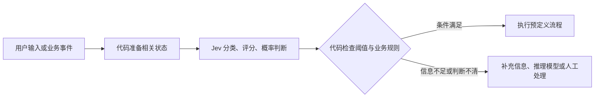

# Jev：面向软件决策的 AI 模型

## 高密度摘要

Jev 是 TypeSafe AI 于 2026 年 9 月 15 日发布的模型，定位为软件内部的快速决策组件。程序提供状态和限定答案的问题，模型返回选择、评分或概率，适合分类、路由、筛选与校验。它把语义判断交给模型，把流程组合和执行交给代码。理解它的入口是：**你的任务能否拆成“读懂信息后，从有限选项中作判断”？** [官方介绍](https://docs.typesafe.ai/introduction)

它受到关注的关键是低价、低延迟和可直接消费的概率输出，但厂商的性能倍数有特定评测条件；类型正确也不代表判断正确。需要生成文章、代码或复杂计划时，仍需要生成模型。本文重点解释能力、成本和接入边界。相关文档：[技术索引](../technology.md)、[Harness](../h/harness.md)、[上下文管理](../c/context-manage.md)。

资料核验日期：2026-09-20。依据官方发布文章和开发文档整理，未调用付费 API 实测；价格、版本和访问状态可能变化。

## 1. 它是什么，为什么最近受到关注？

TypeSafe 把这一产品路线称为 **System One Models**，名称借用《思考，快与慢》中快速、直觉式判断的概念。这里强调的是狭窄、明确的判断任务。“System One”是厂商的模型分类与产品定位，不能据此推断它具有人脑的具体机制。[System One 文档](https://docs.typesafe.ai/concepts/system-one)

这次发布有三个值得关注的点：

1. **输出面向软件。** 开发者预先定义答案空间，结果可以直接用于条件判断、排序和路由。
2. **多个问题共享输入。** 对同一份状态，可以同时询问类别、优先级和某项条件是否成立，减少重复调用。
3. **把不确定性暴露出来。** 程序能根据概率和置信度决定继续处理、补充信息或交给其他系统。[官方介绍](https://docs.typesafe.ai/introduction)

Jev 在 9 月 15 日开放早期访问。官方发布文章称，其端到端延迟约为 70–500 毫秒，并公布了特定工作流中快 193.6 倍、便宜 444.6 倍的结果。这解释了它为何容易引起关注，但这些是厂商评测结果，不能直接作为所有业务的收益预期。[发布文章](https://typesafe.ai/blog/introducing-system-one-models-and-jev)

## 2. 输入和输出是什么？

一次请求主要包含 `state`、`questions` 和 `model`。`state` 是待判断的文本或结构化信息；`questions` 描述问题及答案标准；`model` 指定版本。[Choice 接口说明](https://docs.typesafe.ai/primitives/choice)

| 类型 | 解决什么问题 | 输出与关键规则 |
|---|---|---|
| Choice | 从候选集合中选一个，例如给工单分组 | 返回选项、完整概率分布和 `confidence`；最多 255 个选项，可加入“其他” |
| Score | 在有序标准上评分，例如故障严重程度 | 定义 2–10 个等级，序号从 0 开始；返回概率加权分数、等级概率和 `confidence` |
| Noul | 判断一个命题是否成立，例如是否提出退款 | 返回 0–1 的“是”的概率；没有独立的 `confidence` 字段 |

来源：[Choice](https://docs.typesafe.ai/primitives/choice)、[Score](https://docs.typesafe.ai/primitives/score)、[Noul](https://docs.typesafe.ai/primitives/noul)。

例如，输入“同一个订单扣了两次钱，请帮我退回多收的部分”，可以同时询问：

- Choice：应该交给账单、物流、售后还是其他团队？
- Score：按预先定义的标准，这件事应排在什么优先级？
- Noul：用户是否明确要求退款？

程序再把这些判断与真实交易记录结合。用户描述可以支持“声称重复扣款”的判断，账务事实则需要数据库核验。上述例子是说明性设计，没有实测返回值。

Score 的小数也有明确含义：如果等级 1 的概率为 0.7、等级 2 为 0.3，分数就是 1.3；它是等级位置的加权结果，不能直接解释成某个真实金额或精确测量值。[Score 文档](https://docs.typesafe.ai/primitives/score)

## 3. RLCD 和“校准概率”有什么意义？

TypeSafe 将训练方法称为 **Reinforcement Learning for Calibrated Decisions，RLCD**。其目标是让输出概率与实际结果频率相匹配：一批被预测为 80% 概率的事件，理想情况下应约有 80% 发生。这属于群体统计性质，无法保证某一次判断正确。公开概念说明不足以复现完整训练流程。[AI primer](https://docs.typesafe.ai/introduction/machine-learning-primer)

还需要区分两个字段：

- `probabilities`：各选项或等级的概率分布。
- `confidence`：由该分布形状计算出的集中程度指标，范围为 0–1。

因此，不能把 `confidence = 0.9` 直接读作“这条判断有 90% 的正确率”。实际阈值要用自己的数据验证，并观察自动处理覆盖率和错误率如何一起变化。[Confidence 文档](https://docs.typesafe.ai/confidence)

## 4. 速度和价格该怎样理解？

截至核验日，官方列出的模型是 `jev-1.13.0`，`jev-latest` 和 `jev-preview` 均指向它。

| 项目 | 当前官方规格 |
|---|---|
| 输入价格 | 每百万 token 0.042 美元 |
| 输出价格 | 免费 |
| 总上下文 | 每请求 64K token |
| 单项约束 | `state` 加最长一个问题不超过 32K token |
| 输入模态 | 文本；可用字符串、JSON 对象或文本数组承载 |
| 当前限流 | 每秒 250,000 token；每分钟 1,200 请求，官方提示可能动态调整 |
| 定制方式 | 在状态、问题和标准中提供领域知识；目前不提供客户专属微调或 LoRA |

来源：[Models](https://docs.typesafe.ai/models)。

**成本算例：** 假设每次请求总计 1,000 个计费输入 token，一百万次请求就是十亿 token，模型输入费用约为 **42 美元**。这只是按单价计算，不包含其他模型、网络、存储、重试或业务系统成本。

多问题合并请求可以复用状态，但新增问题仍消耗输入 token，不能把“响应时间增加很少”理解成“问题无限且免费”。[Choice 文档](https://docs.typesafe.ai/primitives/choice)

对性能宣传，需要保留四个条件：官方测试主要在美国西海岸；演示使用较短输入；工作流评分参考其他强模型的平均预测，而非完全依靠真实业务标签；对照 LLM 被要求输出兼容的概率结构，增加了开销。厂商自己也认为首页的倍数处于真实收益的较高一端。[发布文章的评测说明](https://typesafe.ai/blog/introducing-system-one-models-and-jev)

## 5. 适合放在什么位置？

下面是根据接口能力推导的应用选择，属于本文分析，收益需要实测。

| 场景 | Jev 可以负责的部分 | 系统仍要负责的部分 |
|---|---|---|
| 客服工单 | 意图分类、情绪判断、分配候选团队 | 查询订单、核验事实、生成回复 |
| Agent 路由 | 选择工具或技能、判断是否需要升级模型 | 参数校验、权限检查、工具执行 |
| RAG | 判断段落相关性、筛选候选材料 | 检索、组织上下文、生成回答 |
| 内容评估 | 按明确标准判断内容类别或质量 | 制定标准、处理争议、持续抽检 |
| 数据抽取 | 从程序已找出的候选值中选择 | 正则提取、格式规范化、精确计算 |

一个可行的工作流是：

选型时可以依次判断：规则能精确计算的任务交给代码；已有稳定标签与充足训练数据时，对比专用分类器；需要自然语言语义判断且候选答案明确时，评估 Jev；需要开放式写作、代码生成或复杂推理时，使用相应生成模型。这里的价值取决于任务结构，不能只比较模型名称。

## 6. 已知局限与容易误解的地方

官方为 Jev 1.13 单独列出了失败模式：数学与计数、日期比较、多层间接推理、字面理解、无关长上下文，以及对抗性输入都可能导致错误。同一命题用不同问题形式表达，也不保证得到满足算术恒等关系的概率。因此，计算、逻辑一致性约束和最终执行规则应由代码落实。[Jev 1.13 已知局限](https://docs.typesafe.ai/model-jaggedness/jev-1.13)

尤其需要注意三点：

1. **“零幻觉”不能理解成零错误。** 官方宣传中的保证与输出匹配预定义结构有关；从合法选项中选错，依然是业务错误。[发布文章](https://typesafe.ai/blog/introducing-system-one-models-and-jev)
2. **中文能力需要单独测试。** 官方称英语是主要训练语言、当前效果最好，其他语言并不等效。[Models](https://docs.typesafe.ai/models)
3. **检测提示注入的模型也可能受注入影响。** Jev 的状态输入并不天然被视为恶意材料，不能单凭一次模型判断建立安全边界。[已知局限](https://docs.typesafe.ai/model-jaggedness/jev-1.13)

本次查阅的官方资料主要提供托管 API 接入，没有给出可下载的模型权重或完整架构规格。不能根据公开 SDK、第三方同名实现或“新架构”宣传推断模型本体已经开源。

## 7. 怎样开始评估？

官方入口是 [TypeSafe 官网](https://typesafe.ai/) 与 [Quick start](https://docs.typesafe.ai/introduction/quickstart)，提供 Python、JavaScript SDK 和 HTTP API；官网当前仍显示候补申请入口。

对于中文知识库或 Agent 工作流，可以先做一个文档主题分类实验：

1. 从已有文档中抽取一批人工确认类别的样本，覆盖明确、模糊和跨领域内容。
2. 定义有限类别与“其他／信息不足”选项，精简输入，固定问题标准。
3. 与现有规则或小模型比较分类质量、端到端 P50/P95 延迟和实际费用。
4. 按阈值观察覆盖率与错误率，专门检查中文、长输入和边界样本。
5. 固定模型版本后再接入真实流程；升级版本或修改问题时重新验证。

这个实验能回答一个具体问题：Jev 能否以更低成本，承担目前工作流中反复出现、答案范围明确的语义判断？它的商业与工程价值应由这个结果来判断。
