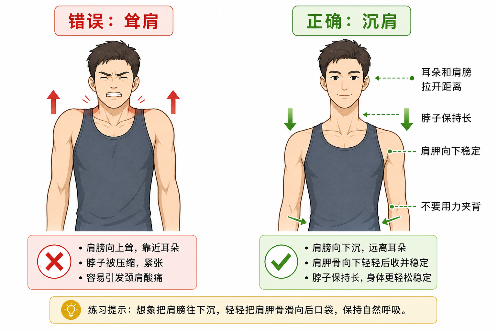

# 沉肩动作指南

## 高密度摘要

- **一句话结论**：沉肩的核心不是把肩膀僵硬往下压，而是在推、拉、支撑和日常姿势中让肩膀远离耳朵、肩胛稳定、脖子保持长。
- **核心机制**：通过减少上斜方肌和提肩胛肌代偿，让背阔肌、下斜方肌、前锯肌等更好参与，同时改善肩胛在胸廓上的稳定性。
- **判断入口**：只要动作中出现耸肩、脖子紧、肩前侧不适、肩膀顶到耳朵，就优先检查是否需要沉肩。
- **常见误区**：沉肩不是用力夹背、不是把肩胛骨压死，也不是所有举手过头动作都要一直下压肩膀。
- **相关文档**：[健康索引](../health.md)、[人体肌肉](../m/muscle-of-human.md)、[流动式活动度训练](../m/mobility-flow.md)。

## 哪些动作要沉肩

需要沉肩的动作，通常是那些容易耸肩、肩颈代偿、肩胛失控的动作。

### 拉类动作

- 引体向上
- 高位下拉
- 坐姿划船
- 哑铃划船
- 杠铃划船
- 硬拉起始和锁定时

这类动作沉肩的目的，是让背阔肌、下斜方肌参与，而不是用脖子和上斜方肌硬拉。

### 推类动作

- 俯卧撑
- 卧推
- 哑铃推胸
- 双杠臂屈伸
- 过顶推举的准备阶段

这类动作沉肩的目的，是稳定肩胛，避免肩膀顶到耳朵，减少肩前侧夹挤和肩颈代偿。

### 核心支撑类动作

- 平板支撑
- 俯身登山
- 倒立撑准备
- 熊爬
- 支撑转体

这类动作沉肩的目的，是让肩胛稳定在胸廓上，避免脖子紧、肩膀塌、支撑结构散掉。

### 日常姿势

- 久坐打字
- 拿手机
- 背包
- 开车

日常姿势中保持轻微沉肩，可以减少长期耸肩带来的斜方肌紧张、颈肩酸痛和头颈前伸代偿。

## 为什么要沉肩

沉肩不是为了把肩膀死死往下压，而是为了让肩胛骨处在更稳定、更省力的位置。

### 减少脖子代偿

耸肩时，上斜方肌和提肩胛肌会过度工作。长期这样训练或久坐，容易出现脖子紧、肩颈酸、头痛和动作发力感混乱。

### 让该发力的肌肉发力

拉背时如果不沉肩，很容易变成“脖子拉”。沉肩后，背阔肌、下斜方肌、前锯肌更容易参与，动作会更像在用背部控制肩胛，而不是用肩颈硬扛。

### 保护肩关节空间

肩膀一直往耳朵方向顶，肩峰下空间可能变小。做推、拉、举时，如果肩胛控制差，更容易出现肩前侧不适或夹挤感。

## 怎么做沉肩

可以用下面几个提示找感觉。

### 肩膀远离耳朵

想象耳朵和肩膀之间拉开距离。这个提示比“把肩膀压下去”更安全，因为它强调的是放松和拉长，而不是硬压。

### 肩胛骨轻轻放进口袋

想象肩胛骨向下、微微向后，像要滑向裤子的后口袋。动作幅度不需要大，也不要用力夹背。

### 脖子保持长

下巴微收，后颈拉长，不要伸脖子。正确沉肩时，脖子应该更轻松，而不是更紧。

### 肋骨别外翻

很多人沉肩时会挺胸、塌腰、肋骨外翻。正确做法是肋骨微收，核心轻轻收紧，让肩胛稳定发生在躯干稳定的基础上。

### 呼气时找感觉

轻轻呼气，肩颈放松，再让肩胛往下安定。呼气能帮助降低肩颈紧张，也能让肋骨更容易回到稳定位置。

## 拉类动作怎么沉肩

适用于引体向上、高位下拉、坐姿划船、哑铃划船和杠铃划船。

拉类动作的核心顺序是：先沉肩，再拉肘。也就是不要一上来就弯手臂，而是先让肩胛骨轻轻向下稳定，再用肘部带动重量。

### 拉类动作的操作顺序

1. 先把脖子放长，不要伸头、缩脖子或耸肩。
2. 先做肩胛下沉，再弯手肘。
3. 想象肘部往身体侧后方走，而不是手把重量拽回来。
4. 拉到顶峰时，仍然保持肩膀远离耳朵，不要最后耸肩补一下。
5. 还原时允许肩胛自然上移，但不要完全松垮耸肩。

### 高位下拉

握住把手后，先不要弯手肘。先让肩胛轻轻向下，感觉腋下和背阔肌被接上。然后再弯手肘，把肘拉向身体两侧。还原时让肩胛自然上移，但不要让肩膀顶到耳朵。

### 引体向上

起始悬挂时不要马上弯手臂。先做一个小幅度的肩胛引体：肩膀远离耳朵，身体微微上升一点。这个位置就是沉肩启动。然后再继续弯肘上拉。

### 划船类动作

划船时不要先耸肩再拉手。先让肩膀远离耳朵，保持胸廓稳定，再想象肘部往身体后侧移动。拉到最后时，肩胛可以自然向后靠近，但不要用力夹背到脖子紧。

### 拉类动作口令

- 先沉肩，再拉肘。
- 肩膀离耳朵远一点。
- 用背带动手，不是用手拽重量。
- 拉到最后也不要耸肩补动作。

## 推类动作怎么沉肩

适用于俯卧撑、卧推、哑铃推胸和双杠臂屈伸。

推类动作的重点不是把肩胛死死往下夹住，而是让肩胛稳定、脖子保持长、肩膀不要顶到耳朵。推类需要稳定，但不能把肩胛锁死到完全不能动。

### 俯卧撑

俯卧撑中，肩胛需要在胸廓上自然活动。下放时肩胛可以自然靠近一点，推起时肩胛可以自然前伸，但整个过程都不要耸肩。

操作要点：

1. 双手撑地后，先把地面推远。
2. 脖子拉长，肩膀不要靠近耳朵。
3. 下放时保持肋骨微收，不要塌腰。
4. 推起时允许肩胛自然前伸，但不要耸肩。

俯卧撑口令：

- 推地，但别耸肩。
- 后颈拉长。
- 肩膀宽，不要缩到耳朵旁。

### 卧推和哑铃推胸

卧推和哑铃推胸中，肩胛需要稳定在凳子上，通常是轻轻向后、向下收住。这样可以让胸廓提供稳定平台，减少肩前侧顶撞感。

操作要点：

1. 躺下后，肩胛轻轻向后、向下收住。
2. 胸口自然打开，但不要为了挺胸而过度塌腰。
3. 推起时肩膀不要跟着重量往上顶。
4. 下放时保持肩胛稳定，肘部大约在身体斜下方，不要完全横着打开。

卧推和哑铃推胸口令：

- 肩胛放进后裤袋。
- 胸打开，肩不耸。
- 手推重量，背稳住身体。

### 双杠臂屈伸

双杠臂屈伸尤其容易耸肩。正确感觉是把身体从肩膀里撑出来，而不是掉进肩膀里。

操作要点：

1. 起始支撑位先把身体撑高。
2. 肩膀远离耳朵，脖子保持长。
3. 下放时不要让肩膀顶到耳朵。
4. 如果一下放就肩前侧不舒服，先减少幅度或换成更容易控制的动作。

双杠臂屈伸口令：

- 把身体从肩膀里撑出来。
- 脖子长，肩膀低。
- 不要掉进肩膀里。

## 判断沉肩是否做到位

如果动作中出现下面情况，通常说明沉肩没做好：

- 脖子越来越紧。
- 肩膀靠近耳朵。
- 上斜方肌酸胀明显，但目标肌肉没感觉。
- 推类动作中肩前侧有夹、顶、疼的感觉。
- 拉类动作像是在用手臂和脖子硬拽。

正确沉肩的感觉应该是：

- 脖子轻松。
- 肩膀稳定但不僵硬。
- 拉类动作更容易感到腋下和背阔肌发力。
- 推类动作更容易感到胸和手臂发力，同时肩关节不顶不夹。

一句话记忆：拉类是“先沉肩，再拉肘”；推类是“肩胛稳住，推的时候肩别耸”。

## 简单练习

站直或坐直，双手自然下垂。

1. 轻轻吸气，但不要耸肩。
2. 呼气时想象肩膀慢慢远离耳朵。
3. 让肩胛骨往裤子后口袋方向滑一点。
4. 保持脖子放松，维持 5 秒。
5. 重复 8-10 次。

练习时的目标不是制造很大的动作幅度，而是找到“肩颈放松、肩胛稳定、脖子变长”的感觉。

## 注意事项

沉肩不是全程僵硬地下压肩膀。比如过顶推举、举手过头时，肩胛骨需要自然上旋，不能强行压死。正确感觉是肩颈放松、肩胛稳定，而不是用力把肩膀往下按。
