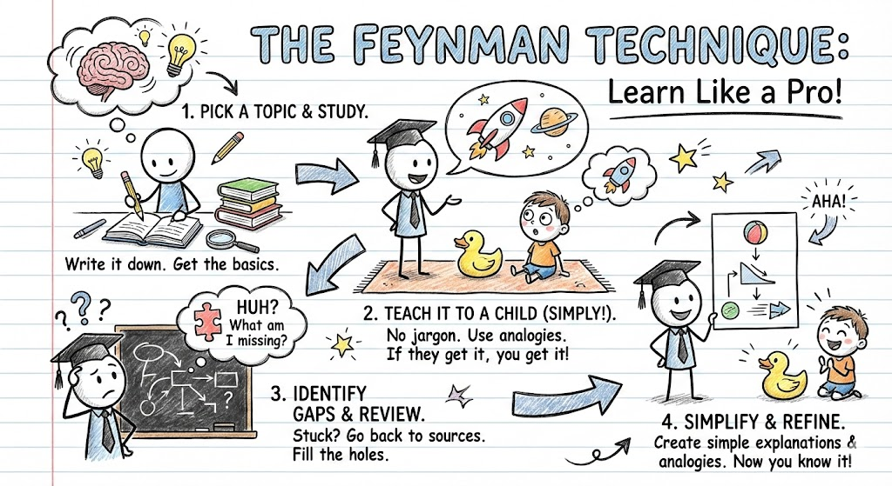
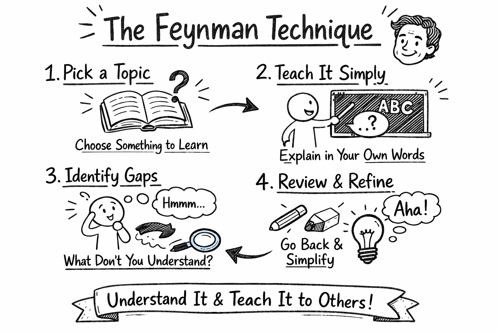

# Image Generation
## Style
### To explain a concept
#### Doodle style
Model: Nano Banana  


Model: DALL·E


#### Simple line drawing, doodle style.
Model: DALL·E

Example prompt:
```
Draw a picture:  to explain Feynman Technique.
Simple line drawing, doodle style.
```


