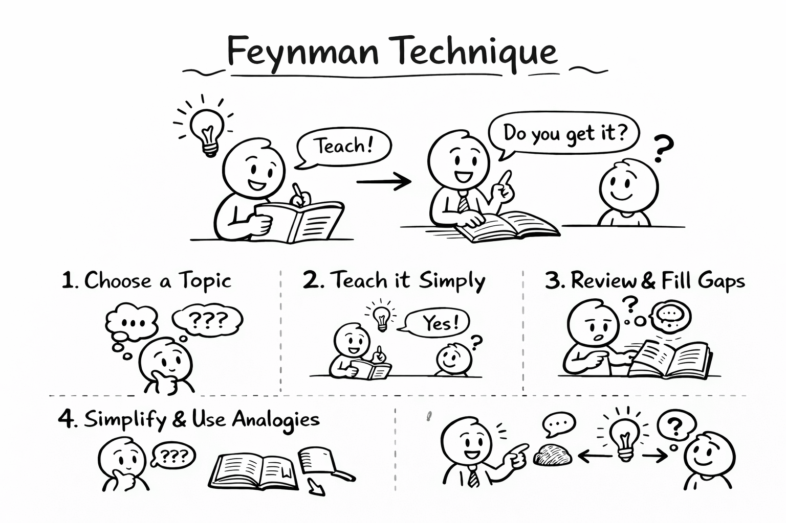

# Image Generation
## Style
### To explain a concept
> Doodle style


> Simple line drawing, doodle style.

Example prompt:
```
Draw a picture:  to explain Feynman Technique.
Simple line drawing, doodle style.
```



