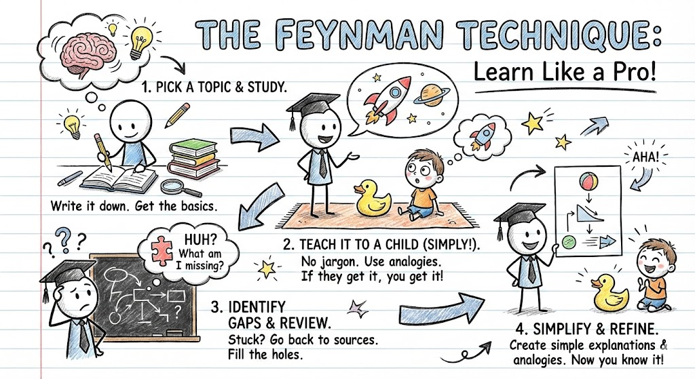
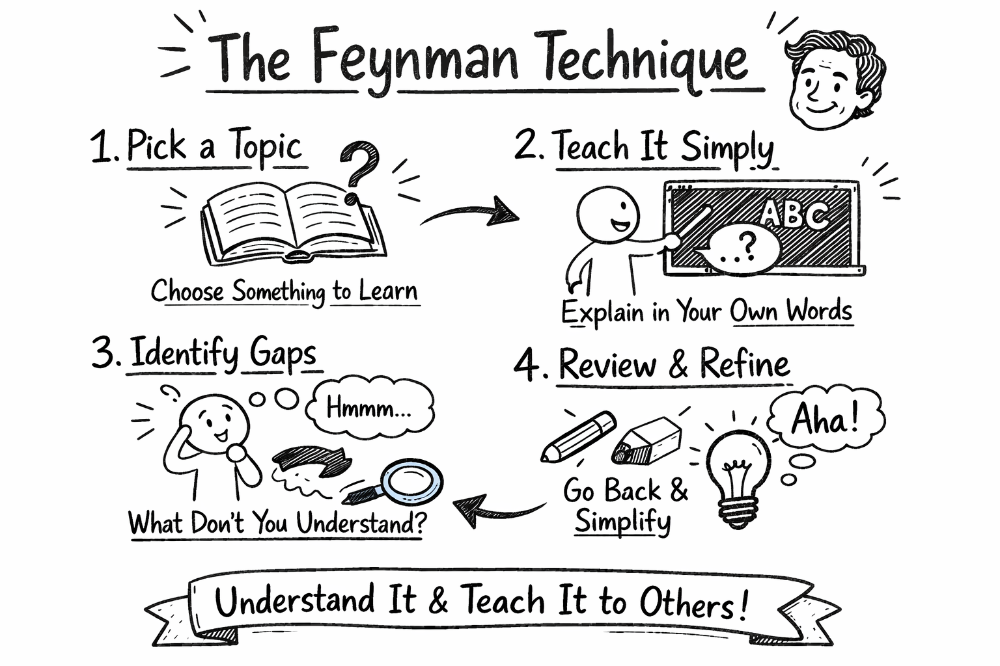
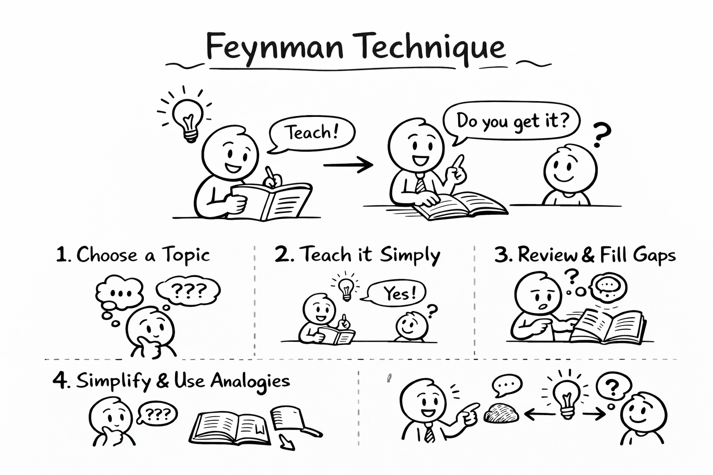

# Image Generation
- GPT-Image-2(26/04/22) 效果炸裂。比 Nano Banana 还好，尤其不会出现文字乱码的情况。

## Style
### To explain a concept
#### Doodle style
Model: Nano Banana  


Model: DALL·E


#### Simple line drawing, doodle style.
Model: DALL·E

Example prompt:
```
Draw a picture:  to explain Feynman Technique.
Simple line drawing, doodle style.
```



