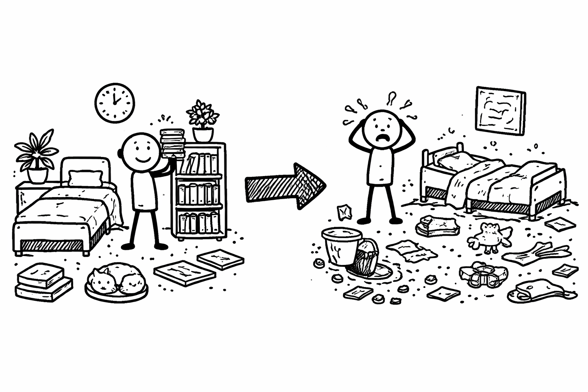
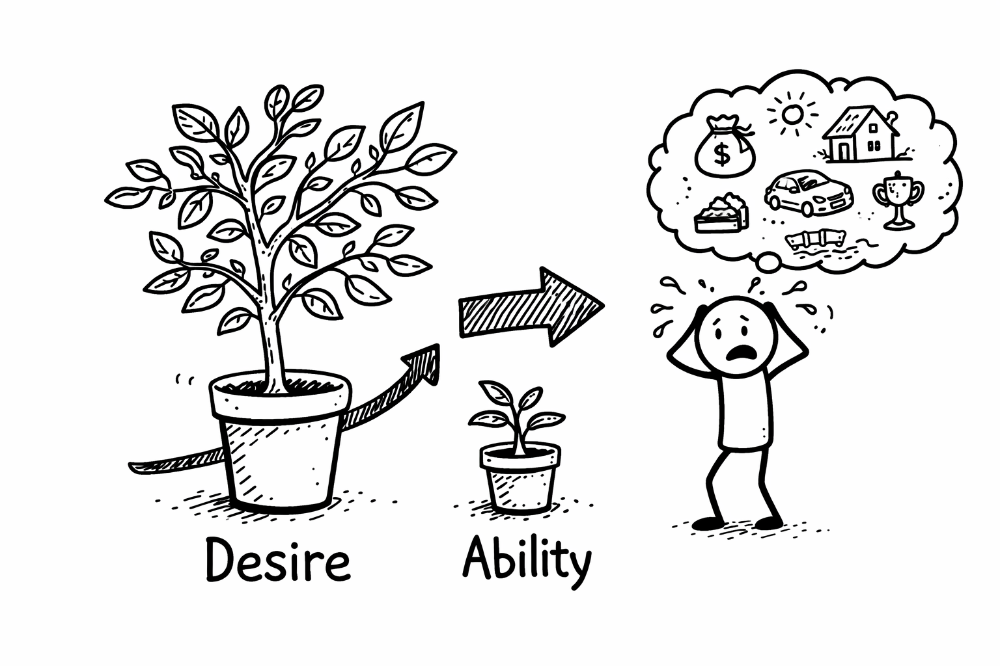
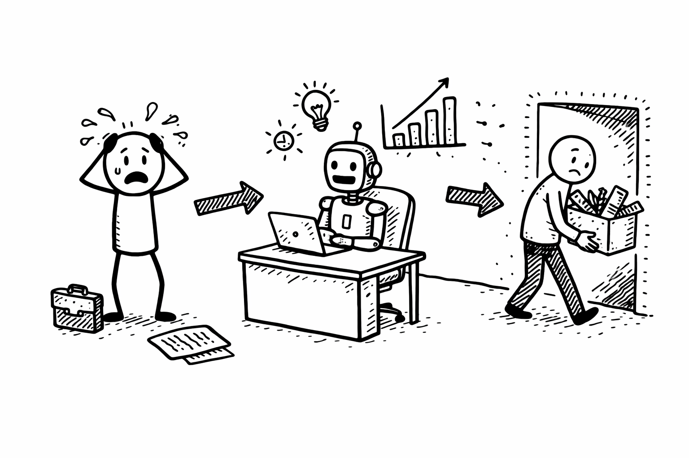
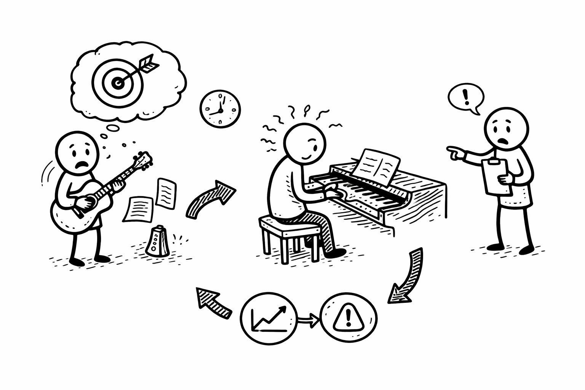

# Jarvis
To have a easy life with the help of Jarvis. I can spend more time on what really matters to me instead of mundane tasks.

Jarvis is an agent based on LLM.

## What makes life such a massive massive
### 1 The Entropy of Existence

Life naturally move from order to disorder. Life requires constant energy to keep things "order."[^1]

### 2 Unhappiness
$$
Happiness = Reality(Ability) / Expectations(Desire)
$$

When **Reality** (your current situation) is less than **Expectations** (what you want), you feel unhappy.

  
**Desire** grows faster than **Ability**. When your ability increases (you get a promotion, you learn a new skill), your brain quickly treats this new level as the "baseline."[^2]

Also, **social media and advertising** constantly raise our expectations, making us feel inadequate.

### 3 Stress of rapidly advancing technology
A society becomes more technologically advanced and efficient, the individuals within it often feel more pressured, anxious, and exhausted.

  
**Attention Fatigue**: Our brains are processing more information in a single day than our ancestors did in a lifetime. This leads to what clinicians now call "digital noise" stress.

  
**AI replacement**: As AI become more capable, many people worry about job security and the future of work. 

## How to resolve
Use Jarvis to help:
1. Accept the "mess".
2. Tame your desires.
3. Deep thinking the life.
4. Automate the SOP.

## Methods
1. **Problem driven** is important. It can help to focus on what really matters.
2. **Feynman Technique**: Explain complex ideas in simple terms to ensure deep understanding.  

3. **Deliberate Practice**:  means a structured and intentional way of practicing to improve specific skills, not just repeating the same activity.

[^1]: Moran, M. J., & Shapiro, H. N. (2006). *Fundamentals of Engineering Thermodynamics*. John Wiley & Sons.  
[^2]: Brickman, Philip, and Donald T. Campbell. "Hedonic Relativism and Planning the Good Society." Adaptation-Level Theory, edited by M. H. Appley, Academic Press, 1971, pp. 287-302.
