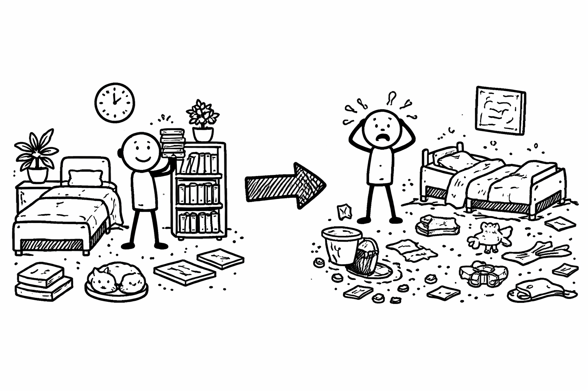
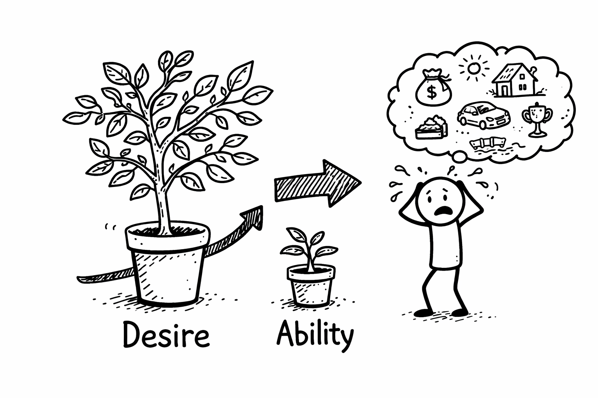
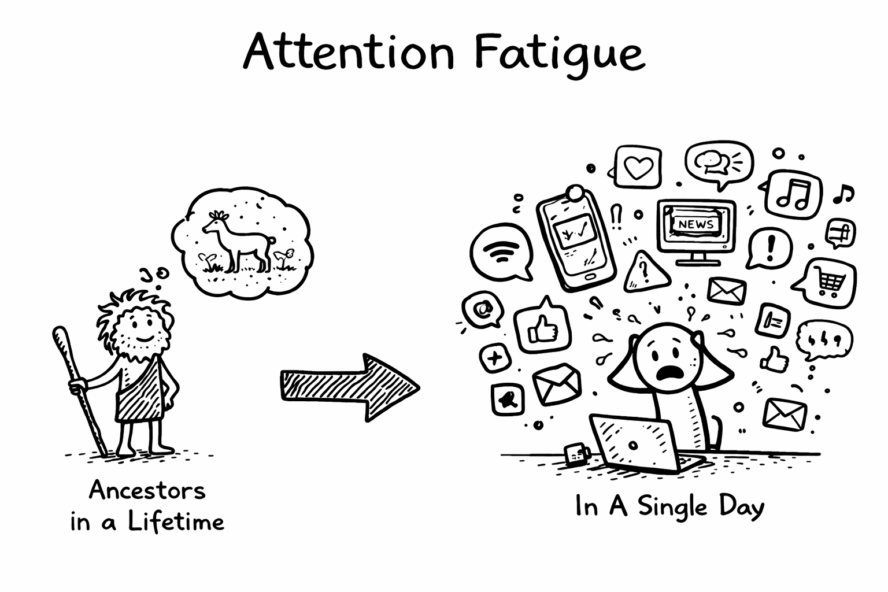
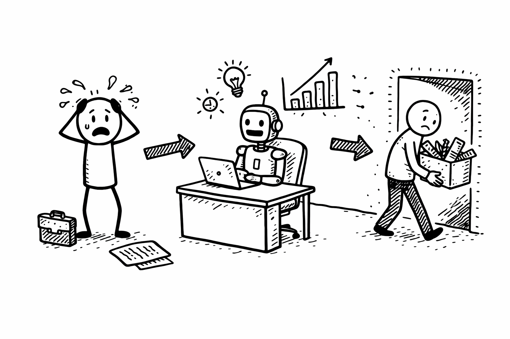
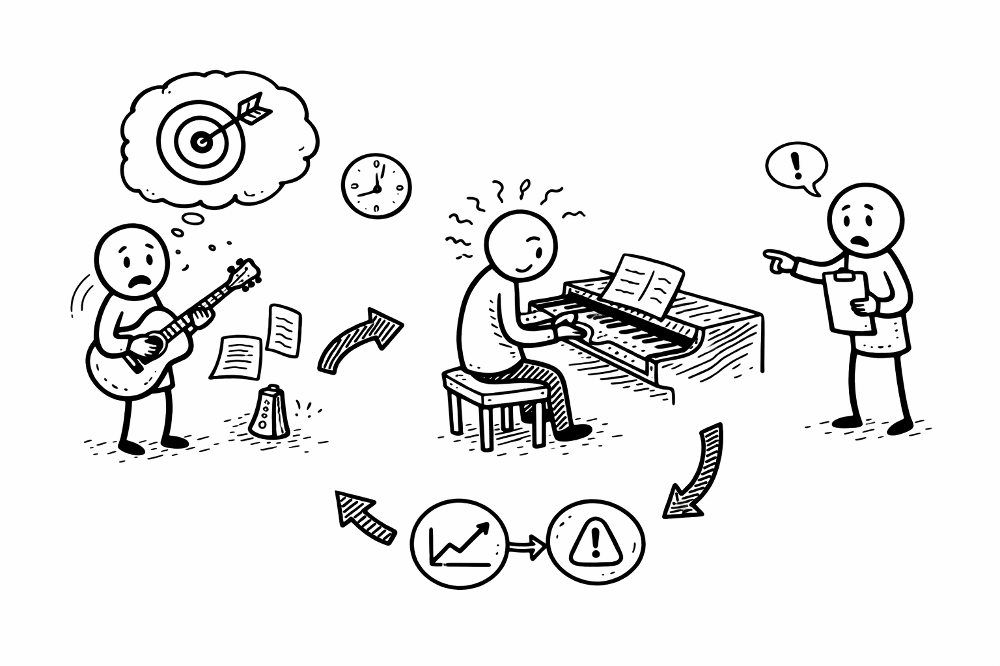

# Jarvis
Live an easier life with the help of Jarvis. Spend more time on what really matters instead of mundane tasks.

Jarvis is an agent powered by LLMs.

## Why life can feel overwhelming
### 1. The Entropy of Existence

Life naturally moves from order to disorder. Life requires constant energy to keep things in order.[^1]

### 2. Unhappiness
$$
Happiness = Reality(Ability) / Expectations(Desire)
$$

When **Reality** (your current situation) is less than **Expectations** (what you want), you feel unhappy.

  
**Desire** grows faster than **Ability**. When your ability increases (you get a promotion, you learn a new skill), your brain quickly treats this new level as the "baseline."[^2]

Also, **social media and advertising** constantly raise our expectations, which can make us feel inadequate.

### 3. Stress from rapidly advancing technology
As society becomes more technologically advanced and efficient, individuals often feel more pressured, anxious, and exhausted.

  
**Attention Fatigue**: Our brains process more information in a single day than our ancestors did in a lifetime. This leads to what clinicians call "digital noise" stress.

  
**AI replacement**: As AI becomes more capable, many people worry about job security and the future of work. 

## How to respond
Use Jarvis to:
1. Accept the "mess".
2. Tame your desires.
3. Think deeply about life.
4. Automate the SOP.

## Methods
1. **Problem driven** is important. It can help to focus on what really matters.
2. **Feynman Technique**: Explain complex ideas in simple terms to ensure deep understanding.  

3. **Deliberate Practice**: A structured and intentional way of practicing to improve specific skills, not just repeating the same activity.

## TO READ
* [PAI: Personal AI Infrastructure](https://github.com/danielmiessler/Personal_AI_Infrastructure)

[^1]: Moran, M. J., & Shapiro, H. N. (2006). *Fundamentals of Engineering Thermodynamics*. John Wiley & Sons.  
[^2]: Brickman, Philip, and Donald T. Campbell. "Hedonic Relativism and Planning the Good Society." Adaptation-Level Theory, edited by M. H. Appley, Academic Press, 1971, pp. 287-302.
