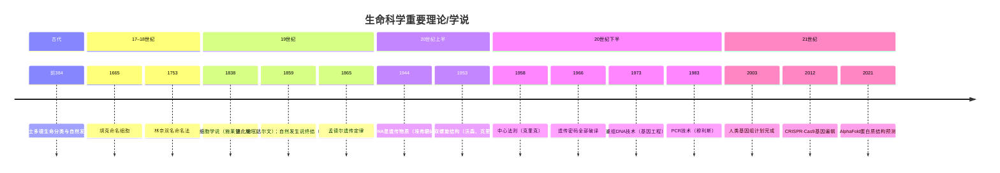

# 生命科学的历史

以重要理论/学说为中心

<!--
本演示文稿以生命科学史上的里程碑理论为主线，串联起人类探索生命奥秘的漫长历程。
-->

---
layout: section
---

# 古代：自然哲学时代
（约公元前 400 年）

---
layout: default
---

## 亚里士多德：最早的生命分类体系

<v-clicks>

- 将生物分为**植物**、**动物**，并对动物做了系统分类
- 提出**灵魂层次说**：营养灵魂（植物）→ 感觉灵魂（动物）→ 理性灵魂（人）
- 认为生命可以从无生命物质中自发产生 —— **自然发生说**（Spontaneous Generation）
- 统治西方生物学近 **2000 年**

</v-clicks>

<!--
亚里士多德记录了约500种动物，是系统生物学的奠基人。
他的自然发生说直到19世纪才被推翻。
-->

---
layout: section
---

# 17–18 世纪：观察与分类时代

---
layout: default
---

## 显微镜革命（1600s）

<v-clicks>

- **罗伯特·胡克**（Robert Hooke，1665）：用显微镜观察软木，命名"**细胞**"（cell）
- **安东尼·范·列文虎克**（Antonie van Leeuwenhoek，1670s）：首次观察到**细菌**和**原生动物**
- 打开了微观生命世界的大门

</v-clicks>

---
layout: default
---

## 林奈：双名命名法（1753）

<v-clicks>

- 卡尔·林奈（Carl Linnaeus）建立了**双名命名法**（Binomial Nomenclature）
- 物种名 = **属名 + 种加词**（如 *Homo sapiens*）
- 构建了**界–门–纲–目–科–属–种**分类阶元体系
- 为现代分类学奠定基础，至今仍在使用

</v-clicks>

---
layout: section
---

# 19 世纪：生命科学奠基时代

---
layout: default
---

## 细胞学说（Cell Theory，1838–1855）

<v-clicks>

- **施莱登**（Matthias Schleiden，1838）：所有植物由细胞构成
- **施旺**（Theodor Schwann，1839）：所有动物也由细胞构成
- **魏尔肖**（Rudolf Virchow，1855）：细胞只能来自已有细胞（*Omnis cellula e cellula*）

</v-clicks>

<v-click>

> **核心命题**  
> 1. 细胞是生命的基本结构单位  
> 2. 所有生物由细胞组成  
> 3. 细胞来源于已有的细胞

</v-click>

<!--
细胞学说与进化论、遗传学并称为现代生物学三大基石。
-->

---
layout: default
---

## 巴斯德：自然发生说的终结（1859–1861）

<v-clicks>

- 设计**鹅颈瓶实验**：密封弯颈瓶中的肉汤长期不腐败，一旦断颈立即腐败
- 证明微生物来自**空气中的尘埃**，而非自然发生
- 奠定了**微生物学**与**灭菌消毒**的基础
- 同期发明**巴氏杀菌法**，拯救了法国葡萄酒、啤酒产业

</v-clicks>

---
layout: default
---

## 达尔文：进化论（Theory of Evolution，1859）

<v-clicks>

- 《**物种起源**》（*On the Origin of Species*）出版，颠覆了"物种固定不变"的神创论
- 核心机制：**自然选择**（Natural Selection）
  - 个体间存在**变异**
  - 变异可以**遗传**
  - 资源有限，产生**生存竞争**
  - 适者生存，**有利变异积累**形成新物种
- 提供了解释**生物多样性**和**共同祖先**的统一框架

</v-clicks>

<!--
达尔文并不知道遗传的分子机制。孟德尔遗传学后来填补了这一空白，形成"现代综合进化论"。
-->

---
layout: default
---

## 孟德尔：遗传定律（Laws of Genetics，1865–1866）

<v-clicks>

- **格雷戈尔·孟德尔**（Gregor Mendel）通过豌豆杂交实验，提出：
  - **分离定律**：等位基因在形成配子时彼此分离
  - **自由组合定律**：非同源染色体上的基因独立分配
- 首次用**数学统计**分析遗传规律（3:1 比例）
- 发表时无人问津，1900 年被重新发现，开创**遗传学**时代

</v-clicks>

---
layout: section
---

# 20 世纪上半叶：揭示分子基础

---
layout: default
---

## DNA 是遗传物质（1928–1944）

<v-clicks>

- **格里菲斯**（Griffith，1928）：肺炎球菌转化实验，发现"**转化因子**"
- **埃弗里**（Oswald Avery，1944）：用酶降解实验证明转化因子是 **DNA**，而非蛋白质
- **赫尔希–蔡斯**（Hershey & Chase，1952）：噬菌体实验用放射性同位素再次确认 DNA 携带遗传信息

</v-clicks>

---
layout: default
---

## DNA 双螺旋结构（Double Helix，1953）

<v-clicks>

- **沃森**（James Watson）和**克里克**（Francis Crick）在**富兰克林**（Rosalind Franklin）X 射线衍射数据基础上
- 提出 DNA **双螺旋**（Double Helix）模型：
  - 两条反向平行的多核苷酸链
  - 碱基配对：**A–T，G–C**（Chargaff 规则）
  - 磷酸-脱氧核糖骨架在外，碱基在内
- 直接揭示了 DNA 的**自我复制**机制
- 发表于 *Nature*，1962 年诺贝尔生理学或医学奖

</v-clicks>

<!--
富兰克林的X射线衍射照片（Photo 51）是关键证据，但她未能分享诺贝尔奖（去世）。
-->

---
layout: section
---

# 20 世纪下半叶：分子生物学革命

---
layout: default
---

## 中心法则（Central Dogma，1958）

<v-clicks>

- **弗朗西斯·克里克**提出生命信息流的基本方向：

</v-clicks>

<v-click>

$$
\text{DNA} \xrightarrow{\text{转录}} \text{RNA} \xrightarrow{\text{翻译}} \text{蛋白质}
$$

</v-click>

<v-clicks>

- 补充：DNA 可自我复制（*DNA → DNA*）
- 1970 年代：发现**逆转录酶**，证明 RNA→DNA 也可发生（逆转录病毒）
- 是分子生物学的**核心框架**，指导了后续几十年研究

</v-clicks>

---
layout: default
---

## 遗传密码的破解（Genetic Code，1961–1967）

<v-clicks>

- **尼伦伯格**（Nirenberg）与**马太伊**（Matthaei，1961）：合成多聚尿嘧啶 RNA，翻译出多聚苯丙氨酸，破译第一个密码子 **UUU = Phe**
- 1966 年：**64 个密码子**全部破译
- 遗传密码具有**简并性、普遍性、不重叠性**
- 1968 年诺贝尔生理学或医学奖

</v-clicks>

---
layout: default
---

## 基因工程：重组 DNA 技术（1970s）

<v-clicks>

- **限制性内切酶**的发现（Arber，Smith，Nathans，1970–1971）：可在特定位点切割 DNA
- **博耶**（Boyer）与**科恩**（Cohen，1973）：首次将外源 DNA 插入质粒，在大肠杆菌中表达
- 开启了**基因工程时代**：胰岛素、生长激素等蛋白质的大规模生产

</v-clicks>

---
layout: default
---

## PCR 技术（Polymerase Chain Reaction，1983）

<v-clicks>

- **凯利·穆利斯**（Kary Mullis）发明 PCR，可在体外快速扩增特定 DNA 片段
- 原理：高温变性 → 引物退火 → 酶延伸，循环反复
- 应用：基因诊断、法医鉴定、新冠检测……
- 1993 年诺贝尔化学奖，被誉为"**改变世界的发明**"

</v-clicks>

---
layout: section
---

# 21 世纪：基因组时代

---
layout: default
---

## 人类基因组计划（Human Genome Project，2003）

<v-clicks>

- 1990 年启动，2003 年完成人类 **~30 亿碱基对**的测序
- 揭示人类约有 **20,000–25,000** 个蛋白质编码基因
- 发现基因组中大量**非编码区域**（曾被称为"垃圾 DNA"）
- 催生了**基因组学、转录组学、蛋白质组学**等组学时代
- 推动**个性化医疗**（精准医学）的发展

</v-clicks>

---
layout: default
---

## CRISPR-Cas9 基因编辑（2012）

<v-clicks>

- **杜德纳**（Jennifer Doudna）与**沙尔庞捷**（Emmanuelle Charpentier）将细菌免疫机制改造为基因编辑工具
- CRISPR-Cas9 实现对基因组的**精准切割与修改**
- 成本低、效率高、操作简便，引发基因编辑革命
- 应用：遗传病治疗、农作物改良、癌症免疫疗法……
- 2020 年诺贝尔化学奖

</v-clicks>

---
layout: default
---

## 当代前沿（2010s–今）

<v-clicks>

- **单细胞测序**：在单细胞分辨率下理解基因表达
- **AlphaFold**（2021）：AI 预测蛋白质三维结构，解决50年难题
- **合成生物学**：设计并构造全新的生命系统
- **表观遗传学**：DNA 甲基化、组蛋白修饰等调控机制

</v-clicks>

---
layout: default
---

## 重要理论时间线

---
layout: center
---

# 生命科学的本质

<v-clicks>

> 从亚里士多德的哲学观察，到 CRISPR 的精准编辑，  
> 人类用了 **2400 年**，  
> 才开始能**读懂并重写**生命的语言。

</v-clicks>

<v-click>

每一次重大理论突破，都源于**新工具**与**大胆假设**的结合。

</v-click>

<!--
生命科学的历史是一部不断打破旧认知、建立新框架的历史。
-->
